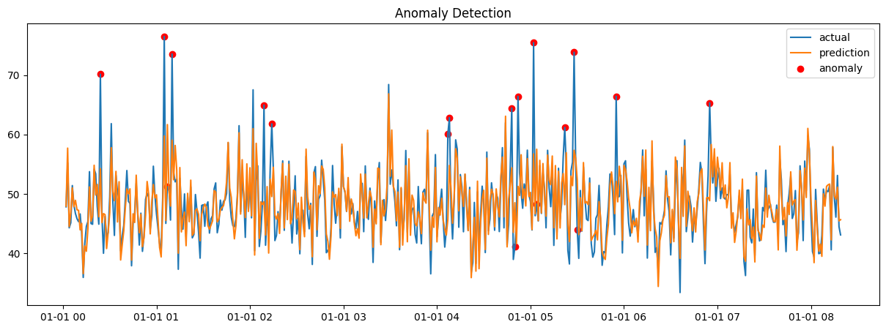
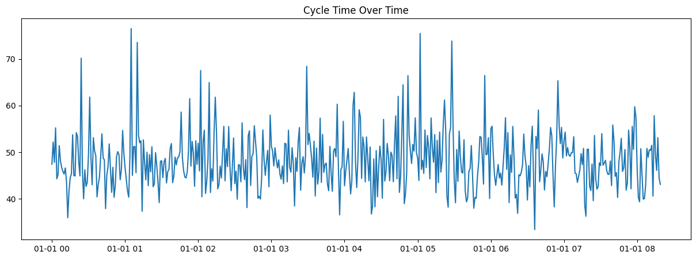

# Manufacturing Cycle Time Anomaly Detection

## 📌 Problem
Unexpected increases in cycle time can indicate machine issues, operator inefficiencies, or environmental problems.

## 🎯 Objective
Detect anomalies in cycle time and understand possible root causes.

## 🧠 Approach
- Synthetic manufacturing data generation
- Feature engineering (lag features, rolling averages)
- Regression model for prediction
- Residual-based anomaly detection

## 📊 Features Used
- Temperature
- Pressure
- Shift (day/night)
- Lag feature (previous cycle time)
- Rolling mean

## 🚨 Anomaly Detection Logic
An anomaly is flagged when the prediction error exceeds a threshold:
esidual = |actual - prediction|
threshold = mean + 2 * std

## 📈 Results
- Anomalies in cycle time are successfully detected
- Key influencing factors identified (temperature, shift)

## 📷 Output

## 🛠️ Tech Stack
- Python
- Pandas
- NumPy
- Scikit-learn
- Matplotlib
